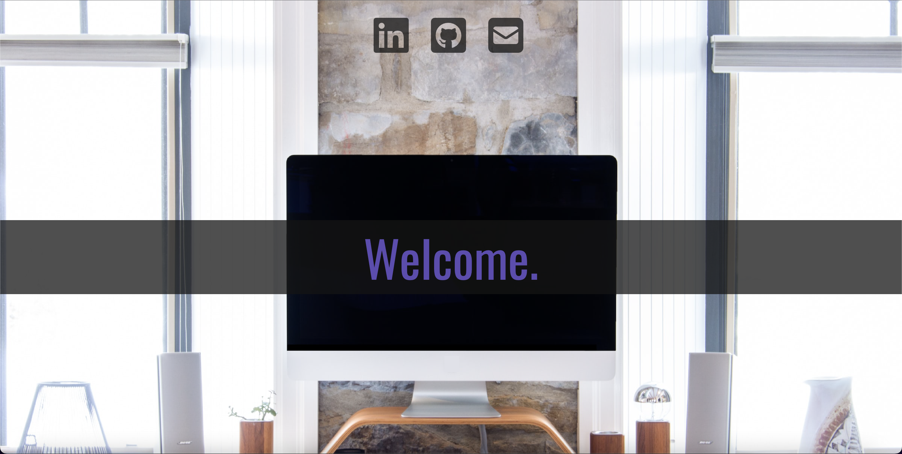
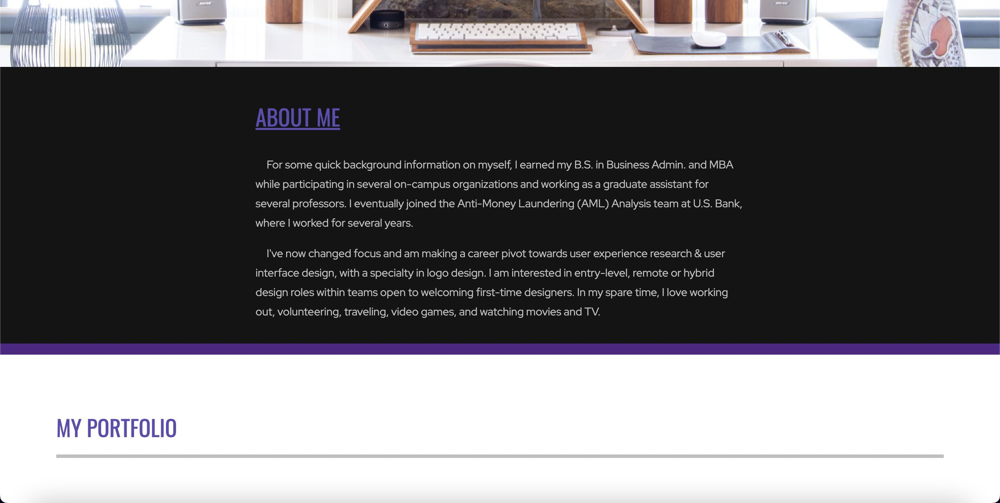
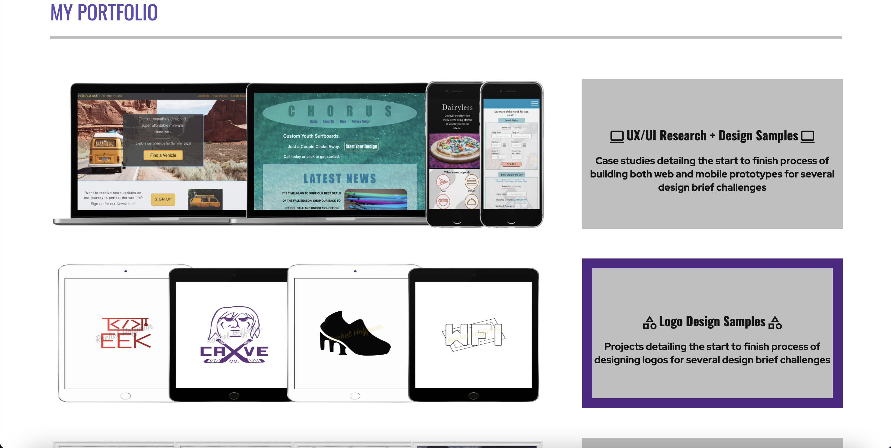
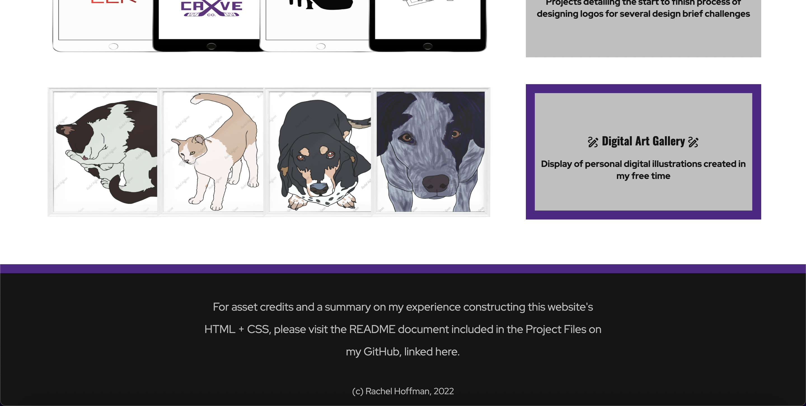

# Project Objective

This is a personally coded website I made in 2022 using Visual Studio Code. My goal was to create a simple one-page website about myself, not focusing on communicating any weighty or intensive content, but to demonstrate my HTML/CSS proficiency for prospective employers/recruiters and let this project serve as an opportunity to grow and solidify my web design/development skillset. I have created two versions (retro and modern) of a personal website with slight differences in HTML code and more significant differences in CSS code, to showcase more than one design example.

# Project Screenshots and Design Explanations

# Asset Credits

The color palette inspiration was sourced from https://www.schemecolor.com/black-gray-and-purple.php. 
Herobox office photo by Gabriel Beaudry on Unsplash - https://unsplash.com/@gbeaudry 
Body font "Red Hat Display" and Heading font "Oswald" were sourced from Google Fonts. 
Link icon SVGs (LinkedIn, GitHub, & Email) were sourced from Font Awesome. 
Table icon SVGs (computer, shapes, & paper & pencil) were sourced from Google Fonts. 
Table mockup photos involving my portfolio work were made by myself using the mockup generation tool PlaceIt, by Envato Elements.
